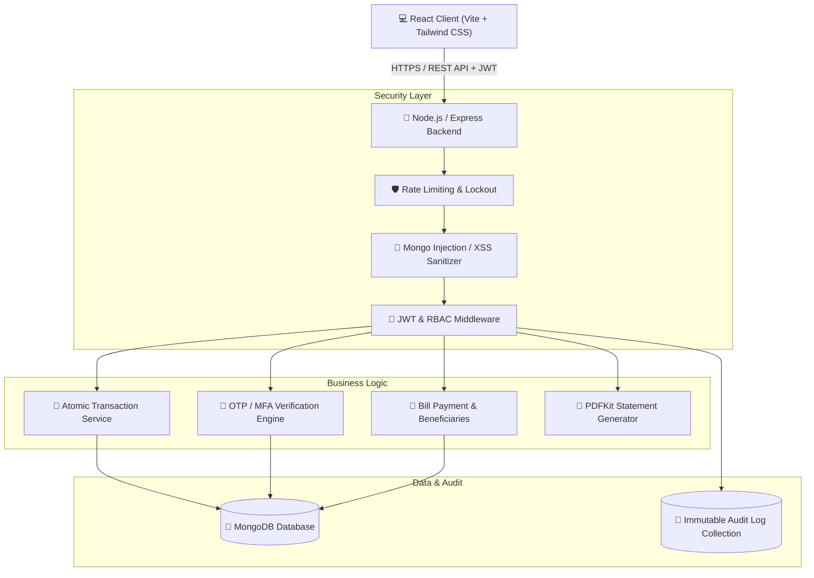

# 🛡️ Suraksha Bank - Indian Digital Banking Simulation (MERN Stack)

[](LICENSE)
[](https://nodejs.org/)
[](https://react.dev/)
[](https://www.mongodb.com/)
[](https://expressjs.com/)
[](https://tailwindcss.com/)
[]()

A comprehensive, production-grade **Indian Digital Banking Simulation System** (**Suraksha Bank | सुरक्षा बैंक**) built with the **MERN Stack** (MongoDB, Express.js, React.js, Node.js). 

Designed tailored for Indian retail and commercial banking with **Rupee (₹ INR) currency formatting**, **IMPS / NEFT / RTGS / UPI remittance channels**, **BBPS utility billing** (BESCOM, Tata Power, BWSSB, JioFiber, Airtel, LIC), **Indian bank references** (SBI, ICICI, HDFC, Indian Bank), **friendly clean white & sky blue UI aesthetics**, and a **dedicated separate Admin/Officer Login portal**.

> ⚠️ **Academic Simulation Disclaimer:** This system is built strictly for academic and educational purposes adhering to modern Indian digital banking workflows.

---

## 📑 Table of Contents

- [Key Highlights & Architecture](#-key-highlights--architecture)
- [System Features](#-system-features)
  - [Customer NetBanking Portal (`/login`)](#customer-netbanking-portal)
  - [Administrative Security & Oversight Portal (`/admin/login`)](#administrative-security--oversight-portal)
- [Security & Engineering Safeguards](#-security--engineering-safeguards)
- [Technology Stack](#-technology-stack)
- [Demo Test Accounts](#-demo-test-accounts)
- [Project Directory Structure](#-project-directory-structure)
- [Getting Started & Installation](#-getting-started--installation)
  - [Prerequisites](#prerequisites)
  - [Quick Start](#quick-start)
  - [Environment Variables](#environment-variables)
- [Demo Test Accounts](#-demo-test-accounts)
- [API Overview](#-api-overview)
- [Automated Testing](#-automated-testing)
- [Comprehensive Documentation](#-comprehensive-documentation)
- [License](#-license)

---

## 🏛️ Key Highlights & Architecture



- **Clean Architecture & Separation of Concerns**: Controllers, services, models, middlewares, and utilities are strictly decoupled.
- **Zero-Setup Database Fallback**: Automatically connects to local or cloud MongoDB; if MongoDB is unavailable locally, it boots an in-memory database automatically for instant evaluation.
- **Dynamic Atomic Transactions**: Multi-account balance updates with session locking and rollback safety.
- **Real-Time Notification & Dynamic Statements**: Instant in-app alerts on debit/credit actions and dynamic client-ready PDF bank statements with watermarks and cryptographic reference numbers.

---

## 🚀 System Features

### Customer Banking Portal
* **🔐 Authentication & Security**:
  * Registration with password complexity enforcement (uppercase, lowercase, numbers, special characters).
  * JWT Token authentication with HTTP Bearer authorization headers.
  * Simulated Two-Factor Authentication (Email/SMS OTP) for sensitive operations (login, large transfers, profile changes).
  * Failed login attempt tracking with automatic account lockout after 5 consecutive failures.
  * Self-service password recovery flow with one-time verification tokens.
* **💳 Multi-Account Management**:
  * Automatic generation of Checking and Savings accounts with unique IBAN-format account numbers.
  * Real-time balance inquiry, available credit tracking, and account nickname customization.
* **💸 Fund Transfers**:
  * Intra-bank account-to-account instantaneous transfers.
  * Beneficiary transfers with saved beneficiary directory and validation against self-transfers.
  * Validation rules ensuring sufficient funds, active account states, and anti-tamper destination checks.
* **🧾 Utility Bill Payments**:
  * Bill payment simulations across multiple utility categories (Electricity, Water, Internet, Mobile, Insurance, Credit Cards).
  * Recurring bill templates and automated receipts.
* **👥 Beneficiary Management**:
  * Save, edit, and organize trusted transfer contacts with instant verification against valid bank accounts.
* **📊 Analytics & Transaction History**:
  * Filterable ledger by date range, transaction type (Debit/Credit/Bill/Transfer), and account.
  * Visual income vs. expense analytics charts powered by Recharts.
* **📄 PDF Statement Generation**:
  * Download formatted official PDF statements with bank header, account breakdown, transaction tables, opening/closing balances, and timestamped watermarks.
* **🔔 In-App Notifications**:
  * Real-time alerts for all balance changes, security events, and login detections with mark-as-read workflows.

---

### Administrative Security & Oversight Portal
* **👑 Role-Based Access Control (RBAC)**:
  * Strict separation between `customer` and `admin` roles, secured on both API routes and frontend routes.
* **👥 User & Account Governance**:
  * Search, view, lock/unlock, or activate/deactivate user accounts.
  * Manual balance corrections and administrative account reviews.
* **🔍 System-Wide Transaction Monitoring**:
  * Global transaction ledger with high-risk transaction flags (large sums, suspicious velocity).
* **📜 Immutable Security Audit Trails**:
  * Full logging of all user activities (logins, failed attempts, transfers, password modifications, admin actions).
  * Records actor ID, action category, IP address, user-agent, timestamp, status, and metadata.

---

## 🔒 Security & Engineering Safeguards

| Threat / Vulnerability | Mitigation Strategy | Implementation |
| :--- | :--- | :--- |
| **Brute-Force Attacks** | IP Rate Limiting & Account Lockout | `express-rate-limit` (100 req/15 min general, 5 req/15 min auth) + 5-attempt lockout for 30 minutes |
| **NoSQL Injection** | Input Sanitization | Custom recursive query and body sanitizers stripping `$` and `.` operators |
| **Cross-Site Scripting (XSS)** | Content Security & Escaping | `helmet` HTTP headers + React automated DOM escaping |
| **Broken Object Level Auth (BOLA)** | User-Resource Ownership Validation | Backend validation in `accountService` and `transferService` matching JWT identity to account records |
| **Race Conditions / Double Spending** | Atomic Balance Updates | Session-based transactions with rollback on failure |
| **Password Exposure** | Cryptographic Hashing | `bcryptjs` with salt round cost factor of 12 |
| **Session Hijacking** | Signed JWT Authentication | Standardized expiration (24h) with bearer token extraction |

---

## 🛠️ Technology Stack

### Backend
* **Runtime**: Node.js (v18+) with native ES Modules (`"type": "module"`)
* **Framework**: Express.js (REST API)
* **Database**: MongoDB & Mongoose ODM
* **In-Memory Testing**: `mongodb-memory-server`
* **Security & Crypto**: `bcryptjs`, `jsonwebtoken`, `helmet`, `express-rate-limit`, `cors`
* **Documents**: `pdfkit` for vector PDF rendering
* **Unit & Integration Testing**: `jest`, `supertest`, `cross-env`

### Frontend
* **Framework**: React 18 with Vite for ultra-fast HMR and bundling
* **Styling**: Tailwind CSS (with bespoke glassmorphism, responsive grid, and dark/light color accents)
* **Icons**: `lucide-react`
* **Data Visualization**: `recharts`
* **State Management**: React Context API (`AuthContext`, `ToastContext`, `NotificationContext`)
* **HTTP Client**: `axios` with global request/response interceptors for token attachment and 401 redirection

---

## 📁 Project Directory Structure

```
Secure-Online-Banking/
├── client/                     # React Frontend Application
│   ├── src/
│   │   ├── components/         # Reusable UI widgets (Navbar, Sidebar, Modal, Cards, ProtectedRoute)
│   │   ├── context/            # Global state (AuthContext, ToastContext, NotificationContext)
│   │   ├── pages/              # View pages (Dashboard, Transfer, Accounts, Admin, Bills, etc.)
│   │   ├── services/           # Axios API service clients
│   │   ├── utils/              # Formatters, currency helpers, date utilities
│   │   ├── App.jsx             # React router configuration
│   │   └── main.jsx            # Entry point
│   ├── index.html
│   ├── vite.config.js
│   └── tailwind.config.js
├── server/                     # Node.js Express REST Backend
│   ├── config/                 # DB connection and environment loader
│   ├── controllers/            # Request handlers (auth, account, transaction, admin, etc.)
│   ├── middleware/             # Auth, RBAC, rate-limiting, error handler, input sanitizer
│   ├── models/                 # Mongoose schemas (User, Account, Transaction, AuditLog, etc.)
│   ├── routes/                 # Express API routing endpoints
│   ├── services/               # Core business logic and database operations
│   ├── tests/                  # Automated integration tests (Jest + Supertest)
│   ├── utils/                  # PDF generator, database seeder, logger
│   └── server.js               # Application bootstrap
├── docs/                       # Comprehensive Academic Documentation
│   ├── requirements.md         # Functional and non-functional requirements
│   ├── architecture.md         # System architecture and data flow diagrams
│   ├── database-design.md      # ER diagrams and schema specifications
│   ├── security.md             # Security mechanisms and threat modeling
│   ├── testing.md              # Test strategy, unit test matrices, and results
│   ├── api-documentation.md    # Complete OpenAPI/REST endpoint specifications
│   └── user-manual.md          # User and administrator operation manual
├── package.json                # Root automation scripts
└── README.md                   # Project overview & documentation
```

---

## 🚀 Getting Started & Installation

### Prerequisites
* [Node.js](https://nodejs.org/) (version 18.0.0 or higher)
* [npm](https://www.npmjs.com/) (version 9.0.0 or higher)
* [Git](https://git-scm.com/)
* Optional: Local MongoDB Server instance or MongoDB Atlas URI (If omitted, system seamlessly runs in embedded memory mode)

### Quick Start

1. **Clone the Repository**:
   ```bash
   git clone https://github.com/Akhil-jatoth/Secure-Online-Banking.git
   cd Secure-Online-Banking
   ```

2. **Install All Dependencies (Root, Server, and Client)**:
   ```bash
   npm run install:all
   ```

3. **Start the Application in Development Mode**:
   ```bash
   npm run dev
   ```
   * Frontend will launch at: `http://localhost:5173`
   * Backend REST API will start at: `http://localhost:5000`
   * Automatic database seeding occurs on startup!

---

## 🔑 Demo Test Accounts

The system automatically initializes standard demo accounts upon startup for rapid evaluation. Convenient one-click login buttons are also provided on the Login screen:

| Role | Email | Password | Pre-seeded Balances / Permissions |
| :--- | :--- | :--- | :--- |
| **👑 System Administrator** | `admin@securebank.test` | `Admin@123456` | Full access to Admin Dashboard, Global Audit Logs, User Management, Transaction Oversight |
| **👤 Primary Customer** | `customer1@securebank.test` | `Customer@123456` | Checking ($15,000.00), Savings ($35,000.00), Active Beneficiaries, Transaction History |
| **👤 Secondary Customer** | `customer2@securebank.test` | `Customer@123456` | Checking ($8,500.00), Savings ($12,000.00) (Target for transfer demonstrations) |

> 💡 **OTP Verification Note:** In development mode, generated 6-digit OTP codes are logged in the backend terminal console and returned in JSON response payloads for convenience.

---

## 📡 API Overview

| Method | Endpoint | Description | Auth Required |
| :--- | :--- | :--- | :--- |
| `POST` | `/api/auth/register` | Register a new customer account | No |
| `POST` | `/api/auth/login` | Authenticate user & receive JWT token | No |
| `POST` | `/api/auth/verify-otp` | Verify simulated 2FA OTP code | No |
| `GET` | `/api/accounts` | Retrieve user's bank accounts & balances | Yes (`customer`) |
| `POST` | `/api/transactions/transfer` | Execute atomic fund transfer | Yes (`customer`) |
| `GET` | `/api/transactions/history` | Retrieve filterable transaction ledger | Yes (`customer`) |
| `POST` | `/api/bills/pay` | Pay utility bill from selected account | Yes (`customer`) |
| `GET` | `/api/statements/download/:id` | Generate and download PDF statement | Yes (`customer`) |
| `GET` | `/api/admin/users` | List and manage all bank customers | Yes (`admin`) |
| `GET` | `/api/admin/audit-logs` | Retrieve immutable security audit trails | Yes (`admin`) |
| `PATCH` | `/api/admin/users/:id/status` | Lock or unlock customer profile | Yes (`admin`) |

*For complete query parameter specs and payload models, consult [docs/api-documentation.md](docs/api-documentation.md).*

---

## 🧪 Automated Testing

The backend includes an automated test suite verifying critical security and transaction flows using Jest and Supertest against an ephemeral MongoDB memory instance:

```bash
# Run all automated test suites
npm run test --prefix server
```

### Test Coverage Highlights:
- ✅ **Authentication**: User registration, password validation, login, token generation, bad password rejection, account lockout.
- ✅ **Atomic Transfers**: Successful debit/credit updates, insufficient funds protection, invalid destination rejection, negative amount rejection.
- ✅ **Beneficiary Management**: Create, view, duplicate protection, invalid account rejection.
- ✅ **Security Protections**: NoSQL injection sanitization, rate-limiting on sensitive auth routes, unauthorized access blocking.

---

## 📚 Comprehensive Documentation

Full academic software engineering lifecycle artifacts are available in the [`/docs`](docs/) directory:

- 📄 [Software Requirements Specification (SRS)](docs/requirements.md)
- 🏗️ [Software Architecture & Design Document](docs/architecture.md)
- 🗄️ [Database Design & Schema Specification](docs/database-design.md)
- 🛡️ [Security Analysis & Threat Model](docs/security.md)
- 🧪 [Software Testing Strategy & Test Matrices](docs/testing.md)
- 🌐 [REST API Reference & Data Contracts](docs/api-documentation.md)
- 📖 [User & Administrator Operation Manual](docs/user-manual.md)

---

## 📄 License

This project is developed for academic software engineering educational purposes and is distributed under the [MIT License](LICENSE).