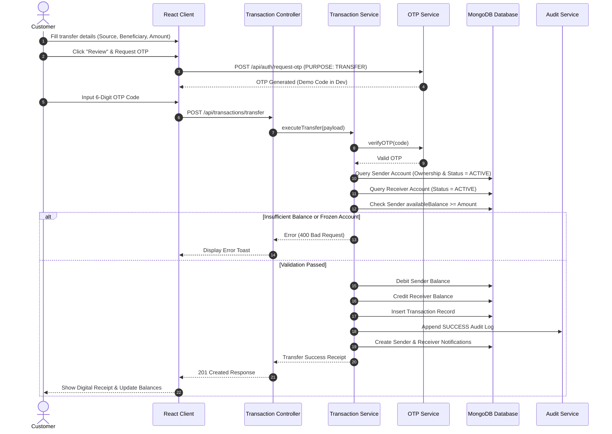

# System Architecture Documentation

## 1. High-Level Architecture

The Aegis Online Banking System is built following the classic **N-Tier Client-Server Architecture** with strict Separation of Concerns (SoC) and Layered Backend Design:

```
+-------------------------------------------------------------------------+
|                         React Frontend (Vite)                           |
|  Pages <-> Layouts <-> Context (Auth, Notif, Toast) <-> Axios Services  |
+-------------------------------------------------------------------------+
                                    |
                          HTTPS REST API / JSON
                                    |
+-------------------------------------------------------------------------+
|                      Node.js / Express.js Backend                       |
|                                                                         |
|  [Security & Rate Limiting Middleware]                                  |
|   -> Helmet, CORS, NoSQL Sanitizer, Rate Limiters                       |
|                                                                         |
|  [Authentication & RBAC Middleware]                                     |
|   -> JWT Verification, Role Checking, Account Lockout Guard             |
|                                                                         |
|  [Express Validation Layer]                                             |
|   -> express-validator Schemas                                          |
|                                                                         |
|  [Controller Layer]                                                     |
|   -> Request formatting, Status codes, Standardized ApiResponse         |
|                                                                         |
|  [Service Layer - Core Business Logic]                                  |
|   -> AuthService, TransactionService, BillService, OTPService, etc.     |
|                                                                         |
|  [Data Access Layer - Mongoose Models]                                  |
|   -> User, Account, Transaction, Beneficiary, Notification, AuditLog    |
+-------------------------------------------------------------------------+
                                    |
                          Mongoose ODM Queries
                                    |
+-------------------------------------------------------------------------+
|                      MongoDB Database Engine                            |
|             Indexed Collections, TTL Indexes, Audit Trails              |
+-------------------------------------------------------------------------+
```

---

## 2. Backend Layer Breakdown

### 2.1 Route Layer (`/server/routes`)
Exposes RESTful endpoints, maps HTTP verbs (GET, POST, PUT, PATCH, DELETE) to controllers, and binds specific middleware chains (rate limiters, validators, auth guards).

### 2.2 Controller Layer (`/server/controllers`)
Responsible for:
- Extracting parameters, body payloads, and client metadata (IP address, user agent).
- Invoking the appropriate service methods.
- Packaging outcomes into uniform `ApiResponse.success` or `ApiResponse.error` formats.

### 2.3 Service Layer (`/server/services`)
Contains 100% of domain business logic:
- **TransactionService**: Handles balance checks, debits, credits, atomic rollbacks, notification creation, and audit trail generation.
- **OTPService**: Cryptographically generates 6-digit random codes, hashes with bcrypt, sets TTL expirations, and tracks verification attempt limits.
- **AuditService**: Writes append-only audit log records for every significant operation.

### 2.4 Model Layer (`/server/models`)
Mongoose schemas enforcing:
- Types, defaults, and custom validation expressions.
- Pre-save hooks for password encryption.
- Unique compound indexes preventing duplicate beneficiaries and data corruption.
- Automatic TTL deletion for expired OTPs.

---

## 3. Frontend Architecture

The React application uses a clean component-driven architecture:

```
client/src/
├── components/     # Reusable UI widgets (Navbar, Sidebar, StatCard, TransactionTable, Charts, Modal, OtpModal)
├── context/        # Global React Contexts (AuthContext, NotificationContext, ToastContext, ThemeContext)
├── hooks/          # Custom hooks (useAuth, useNotifications, useToast, useTheme)
├── layouts/        # Page shells (AuthLayout, DashboardLayout, AdminLayout)
├── pages/          # View components for auth, customer, and admin flows
├── services/       # Axios API client modules mirroring backend routes
└── utils/          # Formatting helpers (currency, masked accounts, dates)
```

---

## 4. Atomic Fund Transfer Sequence


