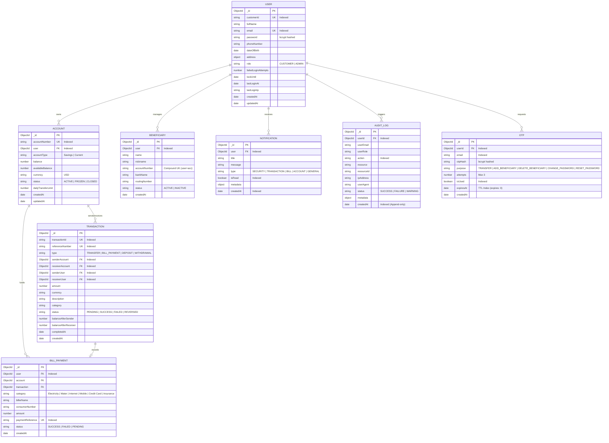

# Database Design & Data Modeling Specification

## 1. Entity-Relationship Overview

The database uses MongoDB with Mongoose ODM. Below is the Entity-Relationship Diagram (ERD):

---

## 2. Key Indexes & Performance Optimization

| Collection | Index Fields | Type | Purpose |
|---|---|---|---|
| **User** | `{ email: 1 }` | Unique | Fast login lookup and prevention of duplicate registrations. |
| **User** | `{ customerId: 1 }` | Unique | Quick customer ID indexing. |
| **Account** | `{ accountNumber: 1 }` | Unique | Direct account destination resolution during fund transfers. |
| **Account** | `{ user: 1, status: 1 }` | Compound | Fast retrieval of a customer's active deposit accounts. |
| **Transaction** | `{ senderAccount: 1, createdAt: -1 }` | Compound | Rapid sorting of sender history. |
| **Transaction** | `{ receiverAccount: 1, createdAt: -1 }` | Compound | Rapid sorting of receiver history. |
| **Transaction** | `{ referenceNumber: 1 }` | Unique | Receipt lookup and duplicate prevention. |
| **Beneficiary** | `{ user: 1, accountNumber: 1 }` | Compound Unique | Prevents customer from adding the exact same account number twice. |
| **OTP** | `{ expiresAt: 1 }` | TTL Index (`expires: 0`) | Automatic MongoDB physical deletion upon token expiry. |
| **AuditLog** | `{ createdAt: -1 }` | Standard | High-throughput admin audit log chronological stream. |
| **Notification** | `{ user: 1, isRead: 1, createdAt: -1 }` | Compound | Instant notification count and badge polling. |
